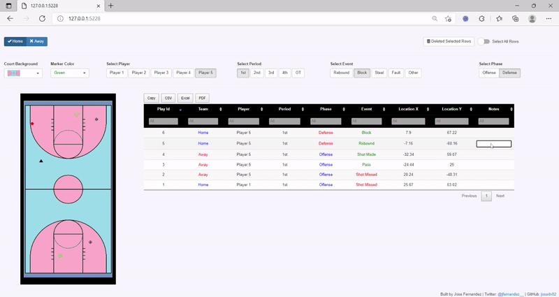

# Basketball Event Tracker App
Annotate and Ttrack the coordinates of various different events in Basketball and export the dataset along with other complementary information for further analysis.  

 
                                                        

### Main App Functionalities

* Select court background
* Select marker color
* Control other info such as home or away team, players, quarter, type of events, etc
* Remove rows from the dataset
* Add notes to table such as minutes and seconds for each play to review later
* Export dataset for further analysis
* etc

### Live App

[Go to APP](https://josedv.shinyapps.io/bball_event_tracker/)

### Check out the code

[Code](https://github.com/josedv82/basketball_event_tracker/blob/master/app.R)
